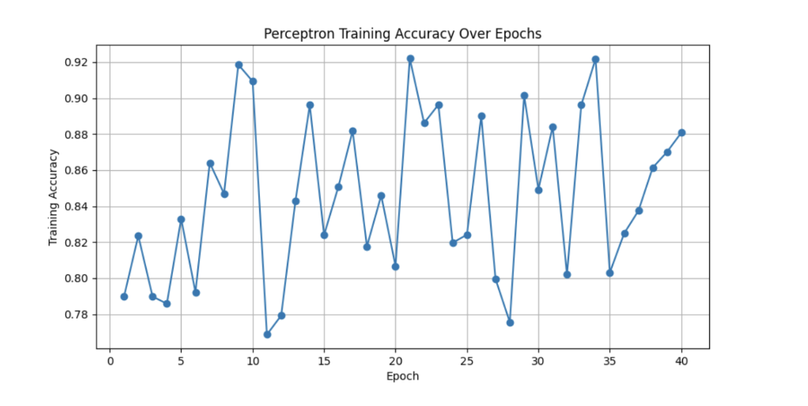
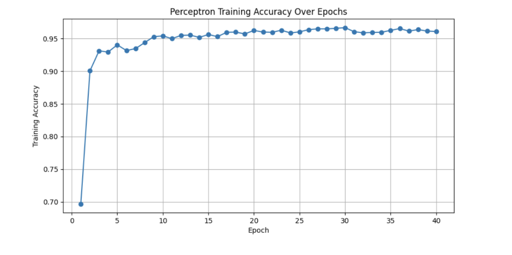
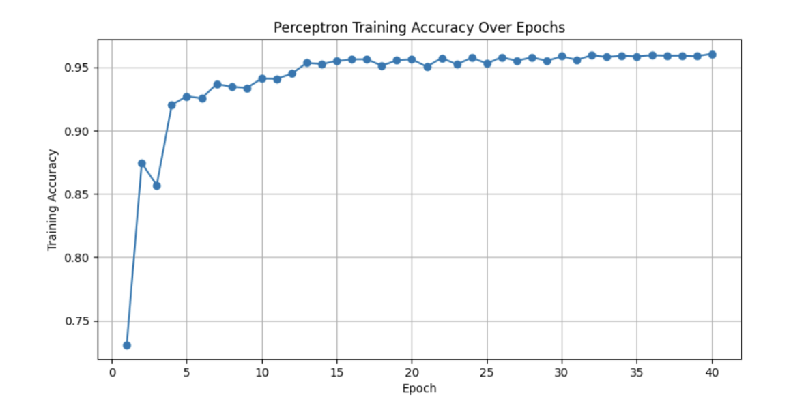

# Fraud Detection Perceptron Model: Development Progress & Results

Originally based on my perceptron algorithm, I decided to utilise this basic form of machine learning to create a fraud detection tool for credit card transactions. To do this, I replaced my randomised mock data which I generated with each perceptron run, with a CSV file of data from Kaggle ([https://www.kaggle.com/datasets/kelvinobiri/credit-card-transactions](https://www.kaggle.com/datasets/kelvinobiri/credit-card-transactions)). I then tested my code by printing off a report of my models performance:

|  | precision | recall | f1-score | support |
| :---- | :---- | :---- | :---- | :---- |
| Legit (-1) | 1.00 | 1.00 | 1.00 | 59915 |
| Frad(+1) | 0.46 | 0.60 | 0.52 | 85 |
| accuracy | / | / | 1.00 | 60000 |
| Macro average | 0.73 | 0.80 | 0.76 | 60000 |
| Weighted average | 1.00 | 1.00 | 1.00 | 60000 |

As you can see, it has good recall for legit transactions, but there is a class imbalance problem, which the dataset actually warns about. This is because fraud cases are \<0.2% of the dataset. 

To fix this issue, I decided to start off by resampling; I used SMOTE as suggested in the datasets about section. It’s slower than undersampling, but has better recall. After this, my new performance looked like this:

|  | precision | recall | f1-score | support |
| :---- | :---- | :---- | :---- | :---- |
| Legit (-1) | 1.00 | 0.76 | 0.86 | 59915 |
| Frad(+1) | 0.01 | 1.00 | 0.01 | 85 |
| accuracy | / | / | 0.76 | 60000 |
| Macro average | 0.50 | 0.88 | 0.44 | 60000 |
| Weighted average | 1.00 | 0.76 | 0.86 | 60000 |

Because perceptrons are simple and do not handle noisy boundaries well, the perceptrons accuracy was horrendous. The recall was much better, which was great because recall is actually much more important than precision when it comes to identifying fraudulent transactions since marking legit transactions as fraud is much less costly than not identifying actual fraudulent transactions. To increase accuracy and precision without sacrificing recall, I decided to do some feature engineering.

Before feature engineering:  

After feature engineering:  

The features I calculated from raw data were:  changes in recipients and senders bank accounts, and amount compared to balance before and after the transaction. These features would much more accurately show whether a transaction might be fraudulent over raw data.

New performance:

|  | precision | recall | f1-score | support |
| :---- | :---- | :---- | :---- | :---- |
| Legit (-1) | 1.00 | 0.92 | 0.96 | 59915 |
| Frad(+1) | 0.02 | 1.00 | 0.04 | 85 |
| accuracy | / | / | 0.76 | 60000 |
| Macro average | 0.51 | 0.96 | 0.50 | 60000 |
| Weighted average | 1.00 | 0.92 | 0.96 | 60000 |

In order to lessen the number of legit transactions that are marked as fraud, my next step was to adjust my decision threshold to raise accuracy hopefully without losing recall. Instead of using a hard boundary, I swapped to calculating a precision-recall curve with a goal recall of 0.9, and made my perceptron cost-sensitive to reduce the number of false alarms.

This allowed for my perceptron's performance to stabilise much better between epochs 30 and 40\. I achieved this by calculating a dynamic decision-threshold using my precision-recall curve.

